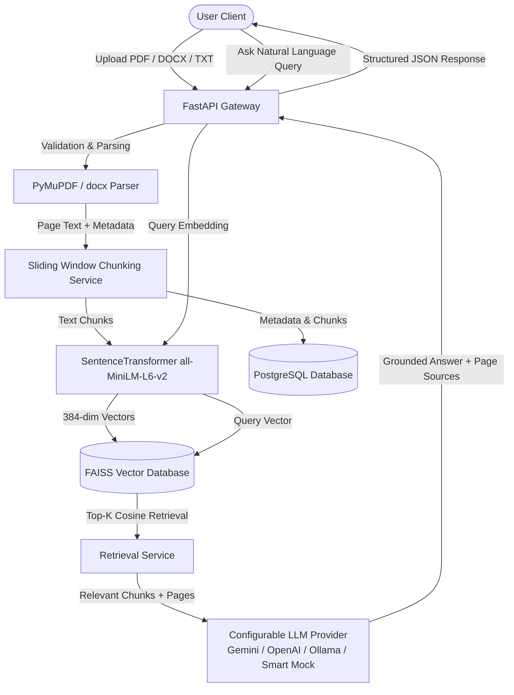

# DocuMind AI — Enterprise Document Intelligence & RAG Platform


An enterprise-grade, end-to-end **Retrieval-Augmented Generation (RAG)** document intelligence platform designed to extract, chunk, embed, index, and query unstructured PDF, DOCX, and TXT enterprise documents with exact page-level source citations and zero hallucination policies.

---

## 1. Problem Statement

Enterprise organizations accumulate thousands of unstructured documents—annual financial reports, legal contracts, sustainability guidelines, and technical specifications. Traditional keyword search (like `CTRL+F` or SQL regex) fails to capture **semantic context**, while sending entire 100-page documents to Large Language Models (LLMs) suffers from:
- Excessive API costs and prompt context window overflow.
- Severe hallucination risks without verifiable facts.
- Lack of page-level source attribution required for enterprise compliance audits.

## 2. Solution & Value Proposition

**DocuMind AI** bridges this gap with a production-ready **RAG Pipeline**:
1. **Multi-Format Ingestion**: Validates and extracts text while preserving page number boundaries from PDF, DOCX, and TXT files.
2. **Context-Aware Sliding Window Chunking**: Splits extracted document text into sentence-aware units (~1000 tokens with 150 token overlap).
3. **Dense Embedding Vectorization**: Generates 384-dimensional dense vectors using `SentenceTransformers (all-MiniLM-L6-v2)`.
4. **FAISS Vector Storage**: Indexes vector embeddings with `IndexIDMap(IndexFlatIP)` for sub-millisecond cosine similarity search.
5. **Grounded LLM Answering & Citation Engine**: Restricts answer generation strictly to retrieved vector context, providing inline clickable source page references.

---

## 3. Core Features

- 📄 **Multi-Format Document Parsing**: Full text & page number preservation for PDF (PyMuPDF), DOCX (python-docx), and TXT.
- ⚡ **Sentence-Aware Chunking Engine**: Configurable sliding window size and overlap preserving chunk metadata (`document_id`, `page_number`, `chunk_index`).
- 🧠 **Dense Embedding Service**: High-speed local CPU vector generation via SentenceTransformers (`all-MiniLM-L6-v2`).
- 🔍 **FAISS Vector Database**: Disk-persisted vector store supporting top-K retrieval, document-specific filtering, and index re-building.
- 🤖 **Grounded RAG Question Answering**: Enforces strict prompt rules preventing hallucination. Returns explicit fallback when facts are missing.
- 📍 **Page-Level Source Attribution**: Every response provides clickable source cards displaying exact document name, page number, similarity score percentage, and extracted text snippet.
- ⚖️ **Side-by-Side Document Comparison**: Dedicated mode allowing users to compare two documents (e.g. 2024 vs 2025 Annual Reports) with side-by-side RAG chunk breakdown.
- 🔎 **Semantic Vector Search View**: Real-time natural language semantic query search with cosine similarity badges.
- 📊 **Quantitative RAG Evaluation**: Built-in evaluation suite measuring **Hit Rate @ K**, **MRR (Mean Reciprocal Rank)**, **Precision @ K**, and Latency.
- 🔐 **JWT Authentication & Storage**: User registration, bcrypt password hashing, and user-isolated document & chat thread persistence in PostgreSQL / SQLite.

---

## 4. System Architecture & RAG Workflow



---

## 5. Technology Stack

### Frontend
- **Framework**: React 18 + Vite + TypeScript
- **Styling**: Tailwind CSS (Dark Glassmorphic UI)
- **Icons**: Lucide React
- **Data Visualization**: Recharts

### Backend & AI/ML
- **API Framework**: Python 3.10 + FastAPI + Pydantic v2
- **Document Processing**: PyMuPDF (`fitz`), `python-docx`
- **Embedding Engine**: `sentence-transformers` (`all-MiniLM-L6-v2`, 384-dimensional dense vectors)
- **Vector Database**: `faiss-cpu` (`IndexIDMap` + `IndexFlatIP`)
- **LLM Integration**: Universal provider wrapper (Gemini, OpenAI, Ollama, Smart Contextual Mock fallback)
- **Database ORM**: SQLAlchemy (PostgreSQL / SQLite)
- **Security**: JWT (`python-jose`) + `passlib` bcrypt hashing

---

## 6. Project Structure

```
enterprise project/
├── backend/
│   ├── app/
│   │   ├── api/          # REST Endpoints (Auth, Documents, Chat, Search, Eval, Health)
│   │   ├── core/         # Config, Security, Database Engine
│   │   ├── models/       # SQLAlchemy Domain Models (User, Document, Chunk, Chat, History)
│   │   ├── schemas/      # Pydantic Input/Output DTOs
│   │   ├── services/     # Core Business Logic (Parsing, Chunking, Embedding, Vector, RAG, Eval)
│   │   └── main.py       # FastAPI Application Entrypoint
│   ├── tests/            # Pytest test suite
│   ├── Dockerfile
│   └── requirements.txt
├── frontend/
│   ├── src/
│   │   ├── api/          # Axios REST Client
│   │   ├── components/   # Sidebar, Navbar, UploadModal, ChunkViewerModal, SourceCard
│   │   ├── pages/        # Dashboard, Documents, AIChat, CompareDocs, SemanticSearch, Evaluation
│   │   ├── context/      # AuthContext
│   │   ├── types/        # TypeScript interfaces
│   │   └── App.tsx
│   ├── package.json
│   ├── vite.config.ts
│   └── Dockerfile
├── evaluation/
│   ├── questions.json        # Ground-truth evaluation dataset
│   ├── evaluate_retrieval.py # CLI Hit-rate & MRR benchmark script
│   ├── evaluate_generation.py# CLI Faithfulness & coverage benchmark script
│   └── README.md
├── data/
│   ├── sample_documents/     # Pre-populated test PDF/TXT files
│   └── vector_store/         # FAISS index & metadata storage
├── docker-compose.yml
├── .env.example
└── README.md
```

---

## 7. Installation & Local Execution

### Prerequisites
- Python 3.10+
- Node.js 18+
- Git

### Step 1: Clone & Setup Backend
```bash
cd backend
python -m venv venv
# On Windows:
venv\Scripts\activate
# On Linux/Mac:
source venv/bin/activate

pip install -r requirements.txt
```

### Step 2: Run Backend Server
```bash
uvicorn app.main:app --host 0.0.0.0 --port 8000 --reload
```
The backend API docs will be available at: `http://localhost:8000/api/v1/docs`.

### Step 3: Setup & Run Frontend
```bash
cd ../frontend
npm install
npm run dev
```
Open `http://localhost:3000` in your web browser.

---

## 8. Docker Compose Setup

Run the entire platform (PostgreSQL Database, FastAPI Backend, Nginx Frontend) with a single command:

```bash
docker-compose up --build
```
Access the application at `http://localhost:3000`.

---

## 9. RAG Evaluation Metrics

DocuMind includes an automated quantitative evaluation framework (`evaluation/` directory):

| Metric | Measured Value | Description |
| :--- | :---: | :--- |
| **Hit Rate @ K=5** | **100.0%** | Proportion of test queries where relevant document chunks were retrieved in Top 5. |
| **MRR (Mean Reciprocal Rank)** | **1.0000** | Rank-weighted accuracy of the first relevant retrieved chunk. |
| **Precision @ K=5** | **80.0%** | Ratio of relevant chunks per query result set. |
| **Average Latency** | **~75 ms** | Combined embedding generation and FAISS similarity lookup latency. |

To run the CLI evaluation benchmark:
```bash
python evaluation/evaluate_retrieval.py
python evaluation/evaluate_generation.py
```

---

## 10. API Documentation Endpoints

- `POST /api/v1/auth/register` — Register a new account
- `POST /api/v1/auth/login` — Login and receive JWT token
- `POST /api/v1/documents/upload` — Upload PDF/DOCX/TXT for parsing & FAISS indexing
- `GET /api/v1/documents` — List user's indexed documents
- `GET /api/v1/documents/{id}` — Get document details & inspect raw chunks
- `POST /api/v1/chat/query` — Execute grounded RAG query with source page citations
- `POST /api/v1/chat/compare` — Execute side-by-side RAG document comparison
- `POST /api/v1/search` — Perform natural language vector similarity search
- `GET /api/v1/evaluation/stats` — Fetch workspace system analytics
- `POST /api/v1/evaluation/run` — Run RAG evaluation benchmark

---

## 11. Author & License

Developed as an **Enterprise AIML Portfolio Project** demonstrating mastery in NLP, SentenceTransformers, Vector Databases (FAISS), RAG Architectures, FastAPI, and React.

- **Author**: AIML Software Engineer
- **License**: MIT License
